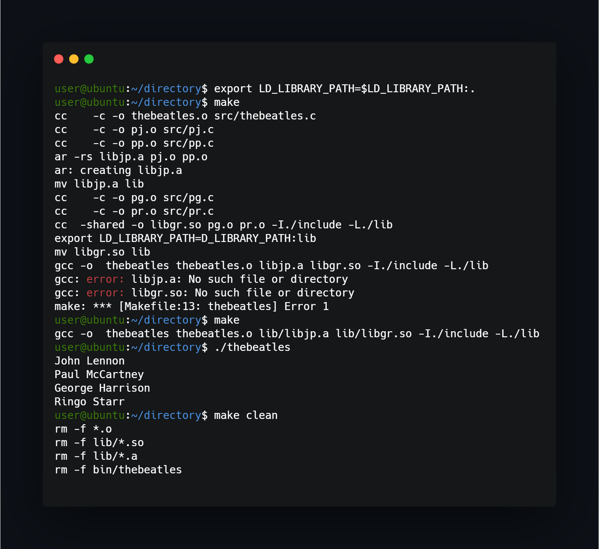

## What project do?
___
This project uses Makefile to generate usable C program with shared library as well as archive library.

## How to install?
___
To install program run 'make' from terminal and program with all it's libraries will compile itself (there need to be two times used make command, because of make not finding its libraries).

## How to use?
___
If you have difficulty running program after compilation i reccomend running `export LD_LIBRARY_PATH=$LD_LIBRARY_PATH:.` - this adds shared library to path. 

## How to uninstall?
___
To uninstall just run `make clean` - this removes compiled instances and leaves original code.
 
<!--https://banner.godori.dev/ height:150-->
<!--https://shields.io/-->
<!--https://carbon.now.sh/-->
